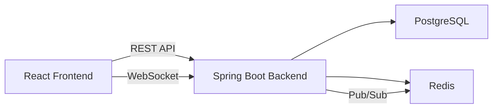

# Notes Management System

A modern notes management app with tagging, sharing, collaboration, comments, version history, and notifications.

## Tech Stack

- Frontend: React, TypeScript, Vite, Tailwind CSS
- Backend: Java Spring Boot, REST API, WebSocket
- Database: PostgreSQL
- Cache/real-time: Redis

## Project Structure

- `frontend/` - React UI
- `backend/` - Spring Boot application
- `docker-compose.yml` - PostgreSQL + Redis + backend + frontend
- `schema.sql` - database schema definitions

## Quick Start

### 1. Install dependencies

- Frontend: `cd frontend && npm install`
- Backend: `mvn clean package` (requires Maven 3.8+)

### 2. Start with Docker

```bash
docker-compose up --build
```

### 3. Demo credentials

- Username: `demo`
- Password: `123456`

### 4. Backend

- Runs at `http://localhost:8080`
- REST API entrypoint: `http://localhost:8080/api`

### 5. Frontend

- Runs at `http://localhost:5173`

## Features

- Create, edit, delete notes
- Rich note editor with markdown-like controls
- Tag management and search
- Sharing with users and groups
- Real-time collaboration via WebSocket
- Comment threads on notes
- Version history and restore support
- Notifications for shared edits/comments

## Architecture



## Database Schema

- `users`
- `notes`
- `tags`
- `note_tags`
- `groups`
- `group_members`
- `shared_notes`
- `comments`
- `version_history`
- `notifications`

## Notes

This project is designed to be demo-ready with a polished UI and modular backend APIs. Add your PostgreSQL credentials in `backend/src/main/resources/application.yml` or use the docker environment variables.
